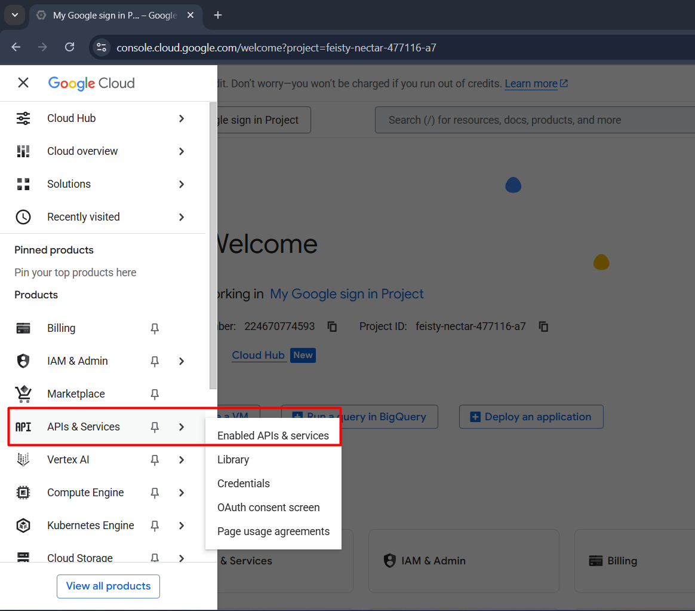
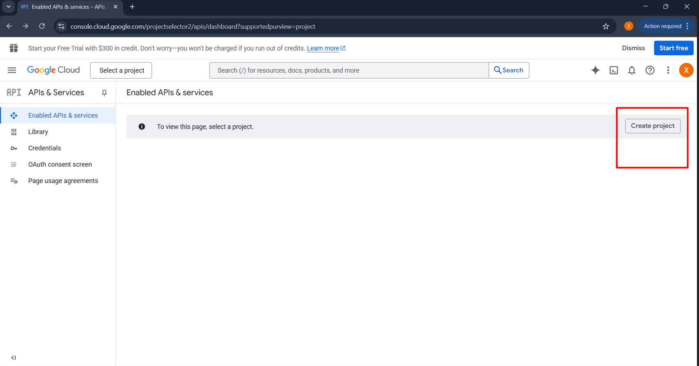
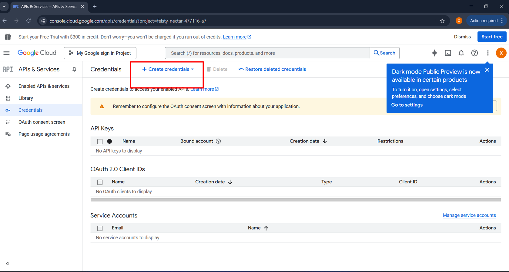
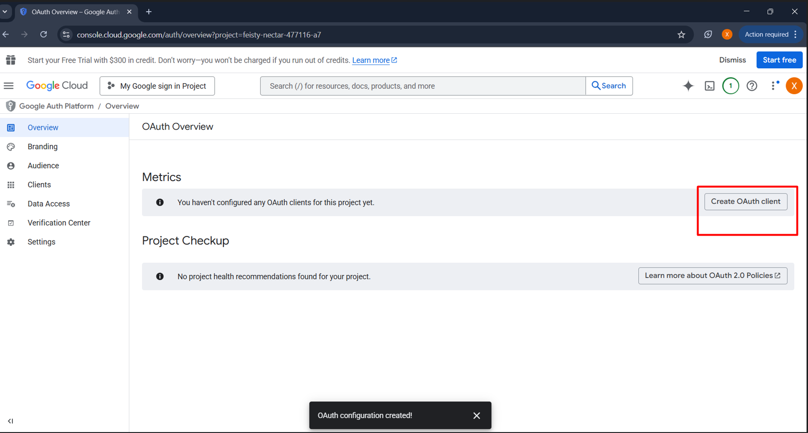
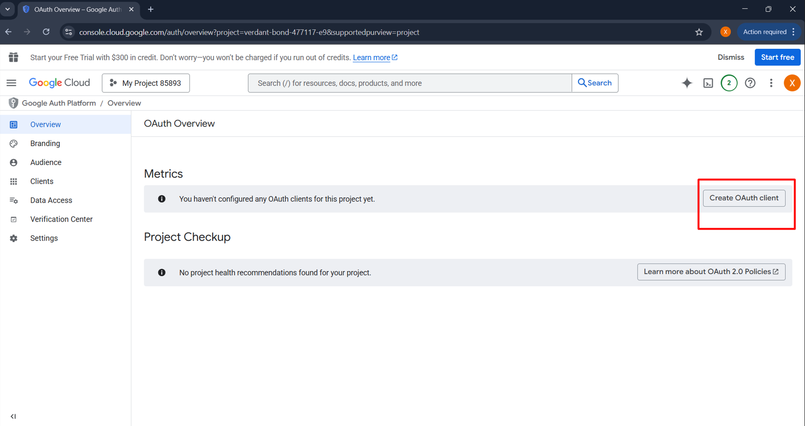
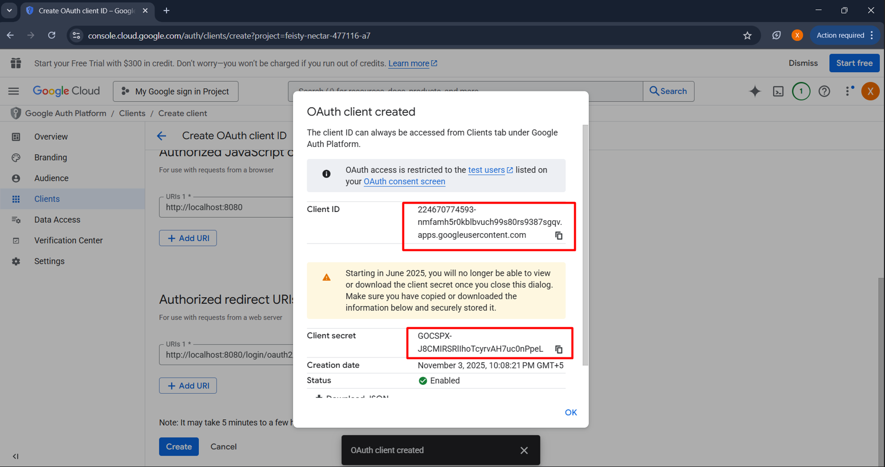

# Google OAuth 2.0 Client Setup Guide

This guide explains how to create a new **Google Cloud Project** and set up **OAuth 2.0 Client IDs** for your web application.

---

## 1. Open Google Cloud Console

Go to [Google Cloud Console](https://console.cloud.google.com/welcome/new).
In the top-left corner, click the **three horizontal lines (☰)**, then select **API & Services**.


---

## 2. Create a New Project

In the **API & Services** window:

* Select **Credentials** from the left menu.
* Click **Create Project**.
* Enter a **Project name** and click **Create**.



---

## 3. Go to Credentials Section

After your project is created:

* Open the **Credentials** tab again.
* Click the **Create credentials +** button.


---

## 4. Choose OAuth Client ID

From the dropdown, select **OAuth client ID**.
You’ll be asked to configure the **Consent Screen** — fill out the required details.




---

## 5. Configure Consent Screen

After completing the consent screen setup, the **OAuth Overview** page will open.
Click **Create OAuth Client** to continue.


---

## 6. Fill in OAuth Client Details

In the **Create OAuth client ID** window, fill out the fields as follows:

| Field                             | Value                                            |
| --------------------------------- | ------------------------------------------------ |
| **Application type**              | Web Application                                  |
| **Name**                          | Web Client                                       |
| **Authorized JavaScript origins** | `http://localhost:8080`                          |
| **Authorized redirect URIs**      | `http://localhost:8080/login/oauth2/code/google` |

Once done, click **Create**.

---

## 7. Get Your Credentials

Google will now generate your **Client ID** and **Client Secret**.
Save these securely — they will be used in your application configuration.



Add the provided credentials to your Spring Boot configuration file `application.yaml` under the Google security section:

```yaml
spring:
  security:
    oauth2:
      client:
        registration:
          google:
            client-id: YOUR_CLIENT_ID
            client-secret: YOUR_CLIENT_SECRET
            scope:
              - email
              - profile
```

Then, run your project and open **[http://localhost:8080](http://localhost:8080)** in your browser.

---

✅ **Tip:**
Do **not** upload your actual `Client ID` or `Client Secret` to GitHub — use environment variables or a secure `.env` file instead.
